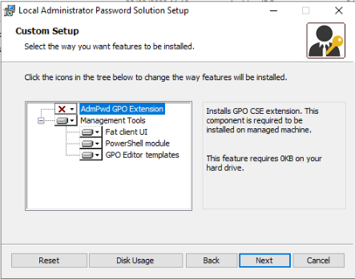

# Documentación de LAPS

## Instalación

- Cuando se procede a instalar LAPS hay que tener en cuenta, que en el servidor Controlador de dominio SOLO tiene que estar instalada la parte correspondiente a LAPS UI y en los clientes tienes que estar solo la parte correspondiente a la GPO.

### Parte correspondiente a la instalacion del servidor

Una vez terminada tienes que importar un modulo desde PowerShell con el comando siguiente:

    Import-module AdmPwd.PS

Y luego actualizar el esquema del nuestro AD, con el comando siguiente:

    Update-AdmPwdADSchema

Esto se realiza para añadir el campo ms-Mcs-AdmPwd y el campo ms-McsAdmPwdExpirationTime, que son para guardar la contraseña del administrador y para el tiempo de expiración de dicha contraseña.

### Parte correspondiente a la instalación del cliente

## Configuración de LAPS

---
Es importante que la cuenta de administrador local este activa por ello es interesante hacer una GPO especifica para ello:

- Para configurar LAPS y hacerlo funcional tenemos que crearnos una GPO. Importante poner la GPO solo en las unidades organizativas donde se va aplicar, ya que si por error instalar la parte de GPO en el servidor además de la herramientas le cambiara la contraseña al administrador y por lo cual perderas el acceso con ese usuario.

- La GPO tiene que tener el siguiente contenido:
  - Esta es la primera directiva que se puede ver:

Dicha directiva sirve para establecer la complejidad que tendrá la contraseña que tendra el usuario administrador y también para especificar longitud de la contraseña y tiempo de expiración de la misma. En este caso tiene una expiracion de un día y una longitud de 20 caracteres. Y la complejidad de la contraseña tiene que tener mayusculas, minusculas, numeros y caracteres especiales.

- La siguiente directiva que demos apreciar es la siguiente:

Como podemos apreciar el administrador no se llama administrador si no que previamente se le ha cambiado la el nombre de la cuenta con una GPO, en este caso la cuenta se llama "Civica_Toor_2503", le decimos que la cuenta de administrador es esa, por lo que le cambiara la contraseña automaticamente a ese usuario.

- La siguiente directiva que nos encontramos es la siguiente, referente a la expiración de la contraseña:

Como se puede ver en la imagen anterior esta directiva se utiliza para cambiar automáticamente la contraseña cuando expire, si se deja sin configurar o deshabilitada cuando pase el tiempo de expiración no se cambiará la contraseña.

- La última directiva que aparecera sera la siguiente:

Esta directiva se utiliza para habilitar el control sobre la contraseña del administrador local.

### __Nota*__

---

Al instalar LAPS enlace la GPO al dominio y se me cambio la contraseña del administrador, por lo que no podía entrar con dicho usuario. Por suerte tenia iniciada sesion con el en un cliente.
Para poder cambiarle la contraseña instale RSAT en el cliente donde tenia el usuario administrador iniciada sesión, mediante consola abri una sesion como administrador local e instale RSAT ya que con el administrador del dominio no se terminaba de instalar bien. Una vez realizado eso correstamente abres una consola de Powershell e importa el modulo ActiveDirectory y le cambias la contraseña al administrador.

---

## Instalación mediante GPO LAPS en los clientes

---

Para poder instalar de forma remota este paquete, necesitamos crea un GPO y enlazarla a la unidad organizativa en la que queramos instalar dicho paquete, ademas en esa unidad organizativa se necesita tener a todos los equipos donde queremos instalar dicho paquete.

De esta manera al iniciar el equipo cliente se instalará de manera automática LAPS.

## Borrar administrador local

---

No se puede borrar el administrador local de un equipo, lo unico que se permite es cambiarle el nombre y desactivar o activar la cuenta. Aparte de cambiarle la contraseña.

## Cambiar nombre de la cuenta administrador local

---

Para cambiar el nombre de la cuenta de administrador hay que realizar una GPO nueva que sería la siguiente:

## Personalizar escritorio de los usuarios

---

Para poder cambiar el fondo de los usuarios, creamos una GPO especifica para ello, la directiva es de usuarios y es la siguiente:

La ruta a al imagen tiene que estar en un directorio compartido.

## Conectar unidades de red

---

Para poder conectar una unidad de red a los usuarios es necesario crear otra GPO y enlazarla a la Unidad Organizativa correspondiente, esta seria la directiva:

## Instalación de software

---

Para instalar software hay una directiva la cual se encarga de eso, pero solo funciona con paquetes con extension msi. Pero la mayoria de la aplicaciones son nos msi son exe, entonces por este medio no se va ha poder instalar nuevo software tipo exe. Una posible solucion es convertir de extensio exe a msi pero no todos los paquetes lo soportan y ademas luego no se instala de manera correcta.

Por todo lo citado antes me he decantado por utilizar Chocolatey, ya que él se encarga de instalar los programas desde su propios repositorios. Lo unico que es que tiene que estar instalado en el cliente, para instalarlo he creado un script de PowerShell que instala en el cliente chocolatey.

### Script instalacion Chocolatey desde PowerShell

### Script instalar programas

Para que lo haga de manera automatica he creado una GPO, para que cuando inicie el equipo cliente se instale todo automatico. El orden es importante primero se tiene que poner el script de powershell para la instalacion de de chocolatey y luego el script de instalacion de aplicaciones.

## Desinstalar aplicaciones

---

Para desinstalar aplicaciones mediante GPO, solo se puede desinstalar una aplicación que previamente se este instalada mediante GPO de lo contrario no se puede eleminar.

Para poder eliminar una aplicacion he creado una script de CMD, que consiste en buscar el programa que queremos borrar, una vez lo encuetra guarda la ruta en un archivo temporal y luego recorro el archivo para quedarme con la ruta donde esta el desinstalador y una vez la encuentre lanzo el desinstalador.

### Script desinstalador

## Activar autentificación contra Directorio Activo de Proxmox

---

Un requisito previo es crear un grupo el cual van a estar dentro los usuarios administrador de AD para proxmox. En mi caso he creado un grupo que se llama VMadmin.

Una vez realizado lo anterior nos vamos a la interfaz web de Proxmox y una vez alli nos vamos a Datacenter y buscamos el apartado Realms y con figuramos uno nuevo de Active directory.

Una vez realizada esta configuracion toca sincronizar con el AD, para ello seleccionamos el nuevo realms y le damos a la aparte de arriba para sincronizar, si todo ha ido bien nos saldara en el estado OK.

Una vez sincronizado toca dar permiso en proxmox al grupo de VMadmin para que los miembros de ese grupo puedan ser administradores. Para ello nos vamos a la parte de permisos y añadimo uno nuevo de grupo y le damos permisos en la raiz al grupo VMadmin-Auth_AD con el rol de Administradores.

Una vez realizado esto ya estaria la autentificacion contra Directorio Activo en proxmox.

## Fallos de instalación de WSUS
---

El fallo que daba era sobre la base de datos que se almacena en WID, el fallo en cuestión mostraba un mensaje así:

    La versi¢n de esquema de la base de datos es de una versi¢n m s reciente de WSUS que la instalada actualmente. Debe aplicar la revisi¢n al servidor WSUS como m¡nimo a esa versi¢n o desconectar la base de datos.

y la solucion que encontre fue la siguiente:

- Como usuario administrador inicar una Powershell y realizar el comando siguiente, que se encarga de desistalar el WSUS:

        Uninstall-WindowsFeature -Name UpdateServices,Windows-Internal-Database -Restart

- Una ver realiazado tenermos que borrar la carpeta WID, que se encuentra en la siguiente ruta:

          C:\Windows\WID

- Por último lanzar este comando, que se encarga de volver a instalar el WSUS:

        Install-WindowsFeature UpdateServices -Restart
