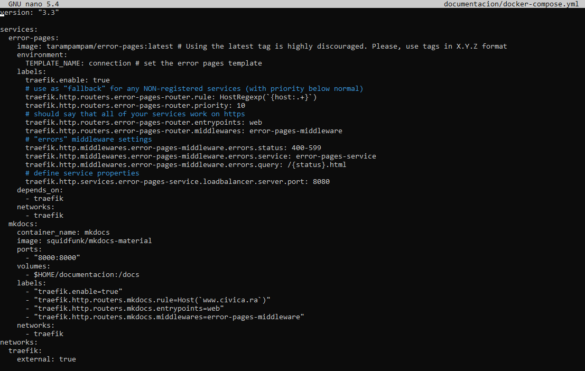

# Configuración de Docker

## Instalacion de Docker y Docker Compose en Linux

- Lo primero es instalar los siguientes paquetes 

~~~
sudo apt install \
    ca-certificates \
    curl \
    gnupg \
    lsb-release
~~~

- Descargamaos la clave GPG oficial:

~~~
sudo mkdir -p /etc/apt/keyrings
curl -fsSL https://download.docker.com/linux/ubuntu/gpg | sudo gpg --dearmor -o /etc/apt/keyrings/docker.gpg
~~~

- Añadimos el repositorio:

~~~
echo \
  "deb [arch=$(dpkg --print-architecture) signed-by=/etc/apt/keyrings/docker.gpg] https://download.docker.com/linux/ubuntu \
  $(lsb_release -cs) stable" | sudo tee /etc/apt/sources.list.d/docker.list > /dev/null
~~~

Por último instalamos docker:

~~~
sudo apt update
sudo apt install docker-ce docker-ce-cli containerd.io docker-compose-plugin
~~~

## Instalación y Configuración del Proxy Traefik en Docker

En esta guia se verá como instalar y configurar Traefik con Docker Compose y ficheros de configuración .toml tanto estáticos como dinámicos.

### Creación del fichero Docker Compose y traefik.toml

- Para empezar tenemos que crear un red en docker para que todos los contenedores estén en esta nueva red, para ello usamos el siguiete comando:

~~~~
docker network create traefik
~~~~

- Ahora crearemos una carpeta en donde almacenaremos los ficheros de docker y traefik (en mi caso la carpeta se llamará traefik):

~~~~
mkdir traefik
~~~~

- Dentro de la carpeta que acabamos de crear, crearemos en primer lugar el fichero [docker-compose.yml](./files/docker-compose-traefik.yml) y en el esribiremos lo siguiente:

~~~
version: "3.3"
services:
  #Aquí pondremos el servicio traefik
  traefik:
    #Utilizaremos la imagen de traefik en la versión 2.7
    image: "traefik:v2.7"
    #El nombre del contenedor será traefik
    container_name: "traefik"
    #Los puertos que abriremos en el docker a la máquina anfitriona
    ports:
      - "2222:2222"
      - "80:80"
      - "443:443"
      - "8080:8080"
      - "3389:3389"
    #Los ficheros que compartiremos al docker
    volumes:
      - "/var/run/docker.sock:/var/run/docker.sock" #Este fichero sirve para conectarse a otros dockers
      - "$HOME/traefik/traefik.toml:/etc/traefik/traefik.toml:ro"  #Este es el fichero de configuración estático (Es la configuración principal)
      - "$HOME/traefik/acme.json:/etc/traefik/acme.json"  #Este fichero sirve para los certificados
      - "$HOME/traefik/services/:/etc/traefik/services/" #En esta carpeta contendrá ficheros de configuración de servicios
    #En los labels pondremos las etiquetas que utilizará traefik para crear una redirrección del servicio
    labels:
      traefik.enable: true #Habilita traefik
      traefik.http.routers.traefik.rule: Host(`traefik.civica.ra`) #Le asigna una URL al servicio
      traefik.http.routers.traefik.service: api@internal #Le asigna el servicio que se va a ejecutar
      traefik.http.routers.traefik.entrypoints: web #Asigna el puerto de entrada
      traefik.http.routers.traefik.middlewares: error-pages-middleware #Asigna un intermediario (En este caso son página de errores)
    #Aqui asignamos la red que utilizará el contenedor
    networks:
      - traefik
#Aquí se creará la red que se utilizarán en los contenedores (Pero en esté caso se utilizará una Red ya existente)
networks:
  #Nombre de la red
  traefik:
    #Indicamos que es una red externa
    external: true
~~~

- Creamos el archivo de configuración [traefik.toml](./files/traefik.toml) que es el archivo de configuración estático:

~~~
#Regla para evitar conflictos con los certificados 
[serversTransport]
  insecureSkipVerify = true
#Puertos por lo que entrarán las peticiones
[entryPoints]
  [entryPoints.web]
    address = ":80"
  [entryPoints.websecure]
    address = ":443"
  [entryPoints.ssh]
    address = ":2222"
  [entryPoints.remoto]
    address = ":3389"
[providers]
  #Habilita la lectura de docker
  [providers.docker]
    #Para que lea los cambios constantemente
    watch = true
    exposedByDefault = false
  [providers.file]
    watch = true
    #Ruta de la carpeta donde están los ficheros de configuración dinámicos
    directory = "/etc/traefik/services"
[api]
  #Para poder entrar a la configuración del traefik en http
  insecure = true
  dashboard = true
#Archivo donde se guardan los certificados
[acme]
  email = "rafael.romera@civica-soft.com"
  storage = "/etc/traefik/acme.json"
  entryPoint = "websecure"
  onDemand = true
  onHostRule = true
~~~

- Luego creamos la carpeta en donde almacenaremos los servicios:

~~~~
mkdir traefik/services
~~~~

- Un ejemplo de servicio [https](./files/proxmox.toml) es el siguiente:

~~~~
[http]
  [http.routers]
    #Aqui pondremos el nombre de un routers
    [http.routers.proxmox]
      #Porque puerto se va a conectar
      entryPoints = ["websecure"]
      #El servicio que va a lanzar
      service = "proxmox"
      #El intermediario que va a utilizar
      middlewares = ["proxmox"]
      #La URL que va a reenviar
      rule = "Host(`proxmox.civica.ra`)"
      #Como es una página segura creamos un TLS
      [http.routers.proxmox.tls]
        #Creamos un certificado simple
        certResolver = "sample"
  #Aqui creamos un intermidiario de autentificación básica 
  [http.middlewares]
    [http.middlewares.proxmox.basicAuth]
      #Este usuario se a creado con el comando "htpasswd -nb usuario contraseña"
      users = [
        "admin:$apr1$J5zByFlE$Hvu/I0MXESVhLQlJ4c8Qx1",
      ]
  #El servicio
  [http.services]
    [http.services.proxmox]
      [http.services.proxmox.loadBalancer]
        passHostHeader = true
      [[http.services.proxmox.loadBalancer.servers]]
        #La URL que va a cargar el servicio
        url = "https://192.168.80.150:8006"
~~~~

- Un ejemplo de servicio [TCP](./files/EscritorioRemoto.toml):

~~~~
[tcp]
  [tcp.routers]
    [tcp.routers.ws]
      entryPoints = ["remoto"] 
      service = "ws"
      #Importante poner el HostSNI con * para no tener que depender del TLS
      rule = "HostSNI(`*`)"
      #[tcp.routers.ws.tls]
        #passthrough = true
  [tcp.services]  
    [tcp.services.ws]
      [tcp.services.ws.loadBalancer]
        [[tcp.services.ws.loadBalancer.servers]]
          address = "192.168.80.5:3389"
~~~~

### Configuración de MkDocs con traefik

-  Lo primero es crear otra carpeta separada de la carpeta de traefik en mi caso la llamaré documentos:

~~~~
mkdir documentos
~~~~

- Dentro de la carpeta crearemos un [docker compose](./files/docker-compose-mkdocs.yml) para el MkDocs, importante que la versión sea la misma que el archivo docker-compose del traefik.

- En esté archivo hay dos servicios, el primer servicio se encarga de darnos [páginas de error](https://github.com/tarampampam/error-pages) html personalizadas, y el segundo servicio es el MkDocs:

