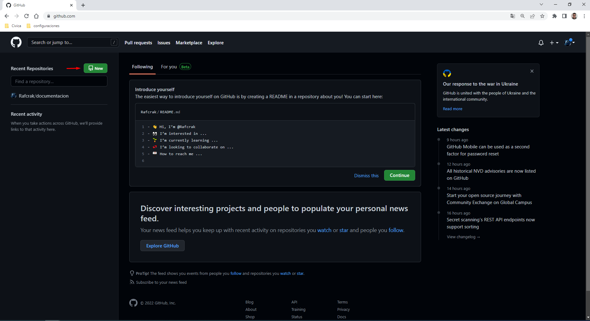
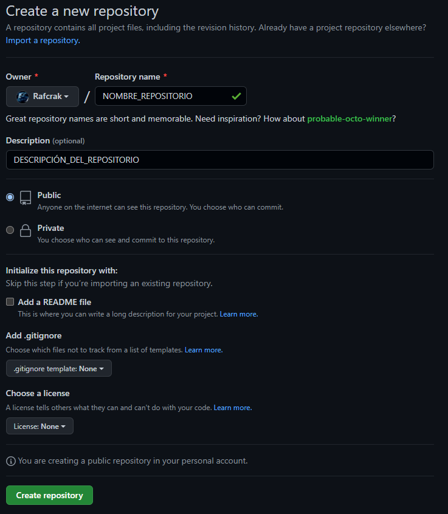

# Configuración de Git

## Asignar tu Nombre y Correo

- Se utilizarán estos dos comandos:

~~~
#Para asignar tu nombre
git config --global user.name "TU_NOMBRE_COMPLETO"

#Para asignar tu correo
git config --global user.email "TU_CORREO_ELECTRONICO"
~~~

## Crear un Repositorio y subir los archivos en GitHub

- Crearemos el repositorio en la página pricipal de [GitHub](https://github.com/) y darle a **New**:

- Aquí tendremos que elegir que nombre y descrición tendrá, si será **Público** por lo que todos los usuarios podrán ver el repositorio, o será **Privado** en donde solo tú y a los usuarios que eligas podrán ver el repositorio, en ambos caso los usuarios que pueden subir archivos al repositorio está a tu elección. Puedes añador un archivo README y un .gitignore para elegir que archivos no quieren que se suban y que licecia vas a utilizar:

- Para subir los archivos al repositorio que acabamos de crear, tenemos que utilizar los siguientes comandos:

~~~
#Iniciamos el proyecto
git init

#Añadimos todos los archivos que vallamos a subir
git add NOMBRE_DE_ARCHIVOS_A_SUBIR

#Y guardamos los cambios con un comentario
#para identificar que cambios se han realizado
git commit -m "COMENTARIO_DE_LOS_CAMBIOS"

#Creamos la rama principal
git branch -M main

#Añadimos la URL del repositorio al proyecto que hemos creado
git remote add origin https://github.com/Rafcrak/NOMBRE_REPOSITORIO.git

#Por último subimos los archivos en la rama principal
#al rempositorio que le hemos añadido
git push -u origin main
~~~

## Solucion de Errores

### No permite la subida de archivos a un repositorio privado

- Si al crear un repositorio privado a la hora de subir o clonar los archivos te da el siguiente error:

~~~
git push -u origin main
remote: Repository not found.
fatal: repository 'https://github.com/Rafcrak/documentacion.git/' not found
~~~

- Para solucionarlo tienes que añadir el usuario de tu cuenta con el siguiente comando:

~~~
git remote set-url origin https://NOMBRE_USUARIO@github.com/Rafcrak/documentacion.git
~~~