# Instalacion de cluster de Kubernetes

En este caso vamos a crear un cluster con un master y un worker.

## Prerequisitos

- Las máquinas tiene que tener un ip fija y en el archivo "/etc/hosts" tiene que tener los nombre de las maquinas con sus IPs.

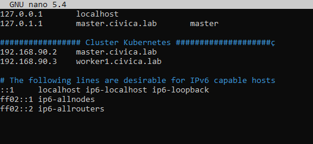

- Ambas maquinas tiene que tener docker instalado, en caso de que una red se parezca o sea igual a la de docker, debes crear en **"/etc/"** el directorio **docker** y dentro el archivo **daemon.json**

~~~
{
        "default-address-pools": [
                {
                        "base": "10.10.0.0/16",
                        "size": 24
                }
        ]
}
~~~

## Instalación del node master con K3s

- **Nota:** la instacion la voy hacer con un usuario con permisos sudo.

Primero es crear la maquina master para ello utilizaremos el siguiente comando:
~~~
curl -sfL https://get.k3s.io | sh -
~~~

Tras lanzar el instalador de K3s, verificamos si se ha instalado todo correctamente:

- La primera comprobación es que el servicio de k3s esta funcionando correctamente:

~~~
sudo systemctl status k3s
~~~

La salida del comando anterior tiene que ser parecida a esta:

~~~
rafa@master:~$ sudo systemctl status k3s
● k3s.service - Lightweight Kubernetes
    Loaded: loaded (/etc/systemd/system/k3s.service; enabled; vendor preset: enabled)
    Active: active (running) since Tue 2022-05-24 13:00:04 CEST; 2min 6s ago
    Docs: https://k3s.io
    Process: 4649 ExecStartPre=/bin/sh -xc ! /usr/bin/systemctl is-enabled --quiet nm-cloud-setup.service (code=exited, status=0/SUCCESS)
    Process: 4651 ExecStartPre=/sbin/modprobe br_netfilter (code=exited, status=0/SUCCESS)
    Process: 4652 ExecStartPre=/sbin/modprobe overlay (code=exited, status=0/SUCCESS)
Main PID: 4653 (k3s-server)
    Tasks: 107
    Memory: 1.2G
        CPU: 2min 7.546s
    CGroup: /system.slice/k3s.service
            ├─4653 /usr/local/bin/k3s server
            ├─4671 containerd -c /var/lib/rancher/k3s/agent/etc/containerd/config.toml -a /run/k3s/containerd/containerd.sock --state /run/k3s/containerd --root /var/lib/rancher/k3s/agent/containerd
            ├─5379 /var/lib/rancher/k3s/data/8c2b0191f6e36ec6f3cb68e2302fcc4be850c6db31ec5f8a74e4b3be403101d8/bin/containerd-shim-runc-v2 -namespace k8s.io -id 31da2861a1ad98a73f9d35221679c39ef3dc091294e25bc36dbad7c0a251f2a4 -address />
            ├─5416 /var/lib/rancher/k3s/data/8c2b0191f6e36ec6f3cb68e2302fcc4be850c6db31ec5f8a74e4b3be403101d8/bin/containerd-shim-runc-v2 -namespace k8s.io -id 296ea24e9e498c31e17ccad68ca278e247a1e1b9a63a53daa93cc88de52f6d23 -address />
            ├─5428 /var/lib/rancher/k3s/data/8c2b0191f6e36ec6f3cb68e2302fcc4be850c6db31ec5f8a74e4b3be403101d8/bin/containerd-shim-runc-v2 -namespace k8s.io -id 1202b92cc1bd714d004bf97a279070ef0e7d7f90fe2ee9ca27d6f7a1693b03ee -address />
            ├─5433 /var/lib/rancher/k3s/data/8c2b0191f6e36ec6f3cb68e2302fcc4be850c6db31ec5f8a74e4b3be403101d8/bin/containerd-shim-runc-v2 -namespace k8s.io -id ed29aa0a2928dc5b4235e5a12aede3ae8733505d9ef4118ec87e28b3a761f242 -address />
            └─5471 /var/lib/rancher/k3s/data/8c2b0191f6e36ec6f3cb68e2302fcc4be850c6db31ec5f8a74e4b3be403101d8/bin/containerd-shim-runc-v2 -namespace k8s.io -id cd975dd7fe9aecc4596cde4b83c36ff76128a95f485d0e124e45fd60765f08f2 -address />

may 24 13:01:05 master k3s[4653]: W0524 13:01:05.875499    4653 handler_proxy.go:104] no RequestInfo found in the context
may 24 13:01:05 master k3s[4653]: E0524 13:01:05.875824    4653 controller.go:116] loading OpenAPI spec for "v1beta1.metrics.k8s.io" failed with: failed to retrieve openAPI spec, http error: ResponseCode: 503, Body: service unavailable
may 24 13:01:05 master k3s[4653]: , Header: map[Content-Type:[text/plain; charset=utf-8] X-Content-Type-Options:[nosniff]]
may 24 13:01:05 master k3s[4653]: I0524 13:01:05.875933    4653 controller.go:129] OpenAPI AggregationController: action for item v1beta1.metrics.k8s.io: Rate Limited Requeue.
may 24 13:01:34 master k3s[4653]: E0524 13:01:34.922677    4653 resource_quota_controller.go:413] unable to retrieve the complete list of server APIs: metrics.k8s.io/v1beta1: the server is currently unable to handle the request
may 24 13:01:35 master k3s[4653]: W0524 13:01:35.266360    4653 garbagecollector.go:707] failed to discover some groups: map[metrics.k8s.io/v1beta1:the server is currently unable to handle the request]
may 24 13:02:05 master k3s[4653]: E0524 13:02:05.044314    4653 resource_quota_controller.go:413] unable to retrieve the complete list of server APIs: metrics.k8s.io/v1beta1: the server is currently unable to handle the request
may 24 13:02:05 master k3s[4653]: W0524 13:02:05.435735    4653 garbagecollector.go:707] failed to discover some groups: map[metrics.k8s.io/v1beta1:the server is currently unable to handle the request]
may 24 13:02:07 master k3s[4653]: I0524 13:02:07.539928    4653 job_controller.go:497] enqueueing job kube-system/helm-install-traefik-crd
may 24 13:02:09 master k3s[4653]: I0524 13:02:09.569646    4653 job_controller.go:497] enqueueing job kube-system/helm-install-traefik
~~~

- La ultima comprobacion es correr el siguiente comando, que debería  devolvernos todos los nodos incluidos en el cluster, de momento solo tenemos el master:

~~~
rafa@master:~$ sudo kubectl get nodes
NAME     STATUS   ROLES                  AGE   VERSION
master   Ready    control-plane,master   6m    v1.23.6+k3s1
~~~

Si las comprobaciones son exitosas ya tendríamos master disponible en nuestro cluster.

## Instalacion de un node Worker con K3s

Tienes que hacer los prerequisitos citados anteriormente.

Para poder unir al cluster un node worker tienes que sacar el token del node master con el siguiente comando:
~~~
rafa@master:~$ sudo cat /var/lib/rancher/k3s/server/node-token
K1063be211206d860b89a9128d3fa396befd28423606d78c3ed1432e7e7873a2aac::server:2bb4732aa6aca7cab3427778b9977135
~~~

Antes de lanzar el script de unión vamos hacer una comprobación, vamos a ver que tenemos ping mediante el nombre que hemos puesto en el archivo **"/etc/hosts"**

~~~
rafa@worker1:~$ ping master.civica.lab
PING master.civica.lab (192.168.90.2) 56(84) bytes of data.
64 bytes from master.civica.lab (192.168.90.2): icmp_seq=1 ttl=64 time=0.646 ms
64 bytes from master.civica.lab (192.168.90.2): icmp_seq=2 ttl=64 time=0.658 ms
64 bytes from master.civica.lab (192.168.90.2): icmp_seq=3 ttl=64 time=0.665 ms
^C
--- master.civica.lab ping statistics ---
3 packets transmitted, 3 received, 0% packet loss, time 2003ms
rtt min/avg/max/mdev = 0.646/0.656/0.665/0.007 ms
~~~

Si tenemos ping, podemos proceder a unirlo al cluster, con el siguiente comando:
~~~
curl -sfL https://get.k3s.io | K3S_URL=https://<server>:6443 K3S_TOKEN=<token> sh -
~~~

Hay que sustituir \<server> por el nombre que hemos puesto en el **/etc/hosts** y \<token> por el token que hemos sacado antes del node master.

Tras sustituir dichos valores, el comando deberia de quedar tal  que así:
~~~
curl -sfL https://get.k3s.io | K3S_URL=https://master.civica.lab:6443 K3S_TOKEN=K1063be211206d860b89a9128d3fa396befd28423606d78c3ed1432e7e7873a2aac::server:2bb4732aa6aca7cab3427778b9977135 sh -
~~~

Tras lanzar estes comando se nos ha instalado el agente de k3s, para comprobar si todo esta correcto tras la instalación vamos a comprobar primero el estado del agente k3s:
~~~
rafa@worker1:~$ sudo systemctl status k3s-agent.service
● k3s-agent.service - Lightweight Kubernetes
     Loaded: loaded (/etc/systemd/system/k3s-agent.service; enabled; vendor preset: enabled)
     Active: active (running) since Tue 2022-05-24 13:27:22 CEST; 1min 56s ago
       Docs: https://k3s.io
    Process: 3721 ExecStartPre=/bin/sh -xc ! /usr/bin/systemctl is-enabled --quiet nm-cloud-setup.service (code=exited, status=0/SUCCESS)
    Process: 3723 ExecStartPre=/sbin/modprobe br_netfilter (code=exited, status=0/SUCCESS)
    Process: 3724 ExecStartPre=/sbin/modprobe overlay (code=exited, status=0/SUCCESS)
   Main PID: 3725 (k3s-agent)
      Tasks: 39
     Memory: 310.9M
        CPU: 24.808s
     CGroup: /system.slice/k3s-agent.service
             ├─3725 /usr/local/bin/k3s agent
             ├─3743 containerd -c /var/lib/rancher/k3s/agent/etc/containerd/config.toml -a /run/k3s/containerd/containerd.sock --state /run/k3s/containerd --root /var/lib/rancher/k3s/agent/containerd
             └─4148 /var/lib/rancher/k3s/data/8c2b0191f6e36ec6f3cb68e2302fcc4be850c6db31ec5f8a74e4b3be403101d8/bin/containerd-shim-runc-v2 -namespace k8s.io -id 879acd6c4dd42de818a9303cf3bd919285258293029fe5d1a9ed450b9ffc80d3 -address />

may 24 13:27:38 worker1 k3s[3725]: I0524 13:27:38.199484    3725 iptables.go:255] Deleting iptables rule: -s 10.42.0.0/16 -m comment --comment flanneld forward -j ACCEPT
may 24 13:27:38 worker1 k3s[3725]: I0524 13:27:38.200409    3725 iptables.go:255] Deleting iptables rule: ! -s 10.42.0.0/16 -d 10.42.0.0/16 -m comment --comment flanneld masq -j MASQUERADE --random-fully
may 24 13:27:38 worker1 k3s[3725]: I0524 13:27:38.208023    3725 iptables.go:255] Deleting iptables rule: -d 10.42.0.0/16 -m comment --comment flanneld forward -j ACCEPT
may 24 13:27:38 worker1 k3s[3725]: I0524 13:27:38.209340    3725 iptables.go:243] Adding iptables rule: -s 10.42.0.0/16 -d 10.42.0.0/16 -m comment --comment flanneld masq -j RETURN
may 24 13:27:38 worker1 k3s[3725]: I0524 13:27:38.215349    3725 iptables.go:243] Adding iptables rule: -s 10.42.0.0/16 -m comment --comment flanneld forward -j ACCEPT
may 24 13:27:38 worker1 k3s[3725]: I0524 13:27:38.225124    3725 iptables.go:243] Adding iptables rule: -s 10.42.0.0/16 ! -d 224.0.0.0/4 -m comment --comment flanneld masq -j MASQUERADE --random-fully
may 24 13:27:38 worker1 k3s[3725]: I0524 13:27:38.230038    3725 iptables.go:243] Adding iptables rule: -d 10.42.0.0/16 -m comment --comment flanneld forward -j ACCEPT
may 24 13:27:38 worker1 k3s[3725]: I0524 13:27:38.239915    3725 iptables.go:243] Adding iptables rule: ! -s 10.42.0.0/16 -d 10.42.1.0/24 -m comment --comment flanneld masq -j RETURN
may 24 13:27:38 worker1 k3s[3725]: I0524 13:27:38.252295    3725 iptables.go:243] Adding iptables rule: ! -s 10.42.0.0/16 -d 10.42.0.0/16 -m comment --comment flanneld masq -j MASQUERADE --random-fully
may 24 13:27:47 worker1 k3s[3725]: I0524 13:27:47.265422    3725 topology_manager.go:200] "Topology Admit Handler"
~~~

La siguiente comprobación es desde el equipo master volvemos a realizar el comando para ver que nodos tenemos en nuestro cluster y deberia de salirnos nuestro worker1:
~~~
rafa@master:~$ sudo kubectl get nodes
NAME      STATUS   ROLES                  AGE     VERSION
master    Ready    control-plane,master   31m     v1.23.6+k3s1
worker1   Ready    <none>                 3m45s   v1.23.6+k3s1
~~~

## Comprobación del funcionamiento

Para ver el funcionamiento de la estructura que hemos creado vamos a crear un servicio de nginx, para ello vamos a crear una carpeta donde meteremos los archivos de configuración:

~~~
rafa@master:~$ ls
nginx
~~~

Dentro de la carpeta crearemos dos archivos

~~~
rafa@master:~$ ls nginx/
nginx-deployment.yml  service.yml
~~~

El archivo **nginx-develoyment.yml** sirve para desarrollar la aplicación:

~~~
#Versión del archivo
apiVersion: apps/v1
#Define la clase del fichero de configuración
#en este caso es de tipo despliegue
kind: Deployment
#Los datos de la aplicación
metadata:
  #Nombre que se le asignará
  name: deployment-nginx
  #Sus etiquetas
  labels:
    #Nombre de la aplicación
    app: nginx
#Las especifinaciones de la aplicación
spec:
  #Especifica cuantas réplicas vamos a consevar
  revisionHistoryLimit: 2
  strategy:
    #Es el tipo de estrategia que utiliza para actualizar los contenedores
    type: RollingUpdate
  #Número de replicas de la aplicación
  replicas: 2
  #Es el selector con el enlazamos la aplicación con el servicio
  selector:
    matchLabels:
      app: nginx
  #Es la plantilla que utiliza la aplicación
  template:
    metadata:
      labels:
        app: nginx
    spec:
      #Ahora ponemos el nombre del contenedor la imagen y sus puertos
      containers:
      - image: nginx
        name: contendor-nginx
        ports:
        - name: http
          containerPort: 80
        - name: https
          containerPort: 443
~~~

Y el archivo de **service.yml** que se encarga de exponer los puertos al exterior:

~~~
#Versión del archivo
apiVersion: v1
#Es la clase que pertenece el archivo
#en esté caso es de clase servicio
kind: Service
#Los datos del servicio
metadata:
  #Nombre del servicio
  name: srv-nginx
spec:
  #Tipo de servicio que vamos utilizar
  #En NodePort: Habre un puerto a la red externa
  #En CloudIP: Habre el puerto en la red interna de kubernetes
  type: NodePort
  ports:
    #Nombre del puerto
  - name: service-http
    #Puerto que se habrirá
    port: 80
    #Nombre del puerto en la aplicación
    targetPort: http
  - name: service-https
    port: 443
    targetPort: https
  #El que enlaza los puertos de la aplicación con los del servicio
  selector:
    #Nombre de la aplicación
    app: nginx
~~~

Una vez creados los archivos tenemos que aplicar la configuración, para ello ejecutamos el seguiente comando en la carpeta en donde tenemos los dos archivos:

~~~
rafa@master:~$ sudo kubectl apply -f nginx/
[sudo] password for rafa:
deployment.apps/deployment-nginx configured
service/srv-nginx created
~~~

Para ver las aplicaciones y servicios que hemos creado lo hacemos con el siguiente comando:

~~~
rafa@master:~$ sudo kubectl get all
NAME                                  READY   STATUS              RESTARTS   AGE
pod/deployment-nginx-d65f5864-6nfh4   0/1     ContainerCreating   0          4s
pod/deployment-nginx-d65f5864-x6v92   0/1     ContainerCreating   0          4s

NAME                 TYPE        CLUSTER-IP     EXTERNAL-IP   PORT(S)                      AGE
service/kubernetes   ClusterIP   10.43.0.1      <none>        443/TCP                      24h
service/srv-nginx    NodePort    10.43.66.193   <none>        80:30035/TCP,443:30155/TCP   4s

NAME                               READY   UP-TO-DATE   AVAILABLE   AGE
deployment.apps/deployment-nginx   0/2     2            0           4s

NAME                                        DESIRED   CURRENT   READY   AGE
replicaset.apps/deployment-nginx-d65f5864   2         2         0       4s
~~~

Podemos ver que funciona correctamente si entramos a la página que hemos creado por el puerto aleatorio que nos ha asignado que podemos ver en el comando anterior, en este caso es el puerto *30035*:

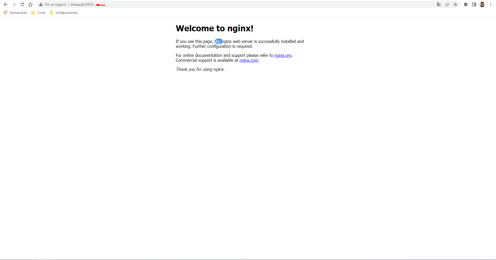

## Instalación de Rancher

Rancher es un administrador de Kubernetes Web con el cual nos facilitará la gestión para crear servicios, para su instalación tenemos que ejecutar los siguientes comandos:

Añadimos el repositorio de rancher

~~~
sudo helm repo add rancher-latest https://releases.rancher.com/server-charts/latest
~~~

Creamos un nuevo namespace donde se instalará Rancher

~~~
sudo kubectl create namespace cattle-system
~~~

Creamos un gestor de certificados

~~~
sudo kubectl apply --validate=false -f https://github.com/jetstack/cert-manager/releases/download/v1.0.4/cert-manager.crds.yaml
~~~

Creamos un namescpace para el gestor de certificados

~~~
sudo kubectl create namespace cert-manager
~~~

Añadimos el repositorio del programa jetstack (Programa necesarío para el funcionamiento de Rancher)

~~~
sudo helm repo add jetstack https://charts.jetstack.io
~~~

Actualizamos repositorios

~~~
sudo helm repo update
~~~

Instalamos jetstack que es un gestor de certificados

~~~
sudo helm install \
  cert-manager jetstack/cert-manager \
  --namespace cert-manager \
  --version v1.0.4
~~~

Con todos los requisitos instalados ya podemos instalar Rancher, poniendo vuestro respectico dominio en la parte de **"--set"**

~~~
sudo helm install rancher rancher-latest/rancher \
  --namespace cattle-system \
  --set hostname=rancher.civica.ra
~~~

Para comprobar que se ha instalado es con el siguiente comando

~~~
~$ sudo kubectl -n cattle-system rollout status deploy/rancher
Waiting for deployment "rancher" rollout to finish: 0 of 3 updated replicas are available...
deployment "rancher" successfully rolled out
~~~

Terminada la instalación nos vamos al navegador y entramos por el dominio que introducimos en la instalación, y nos aparecerá una página en la que nos pedirá una contraseña, esto contraseña se consigue introduciéndo el comando que nos aparece arriva:

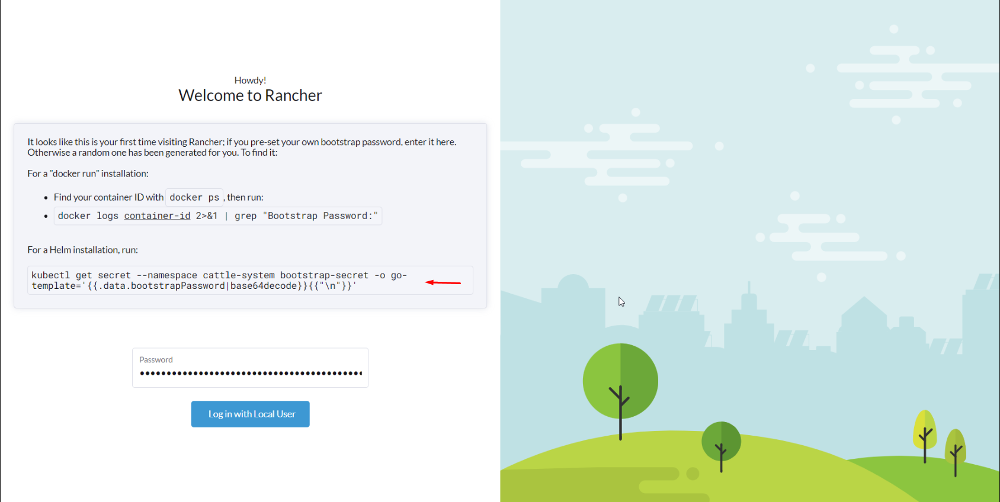

Introduciendo el comando aparece la contraseña

~~~
rafa@master:~$ sudo kubectl get secret --namespace cattle-system bootstrap-secret -o go-template='{{.data.bootstrapPassword|base64decode}}{{"\n"}}'
pqcsbpq2gtthr86c2k22twm4xxjfztrpd6k7r86h57c6gzmr9pqlxw
~~~

Luego podremos remplazar la contraseña a una nuestra propia para terminar de registrarnos y con eso ya estaríamos dentro del panel de control de Rancher

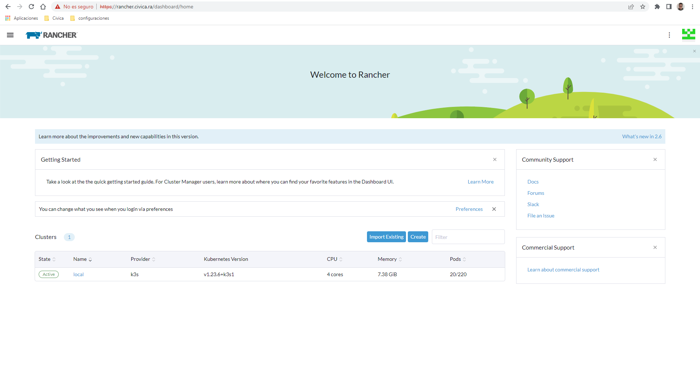

## Instalar treafik

Para instalarlo nos vamos a la pestaña de Apps y en esta a Charts una vez dentro buscamos treafik y procedemos a instalarlo.

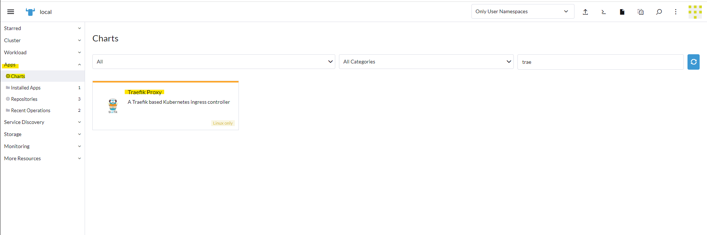

Una vez seleccionado le damos a instalar. Para que no de fallo de namespace  y de loadbalancer hay que modificar unos valores antes de instalarlo:

[![Instalacion_traefik]](Instalacion_traefik)

[Instalacion_traefik]: ./assets/img/traefik_install.png

- En service tienes que modificar type de loadbalancer a ClusterIP y en rbac tienes que modificar namespaced a true. 

Una vez instalado te creas un ingressroute para poder acceder al dashboard

~~~
# dashboard.yaml
apiVersion: traefik.containo.us/v1alpha1
kind: IngressRoute
metadata:
  name: dashboard
spec:
  entryPoints:
#    - web
    - websecure
  routes:
    - match: Host(`traefik.civica.lab`) && (PathPrefix(`/dashboard`) || PathPrefix(`/api`))
      kind: Rule
      services:
        - name: api@internal
          kind: TraefikService
~~~

Una vez aplicado lo lanzamos al cluster con el siguiente comando:

~~~
adrian@master:~$ sudo kubectl apply -f dashboard.yml
~~~

Una vez realizado esto ya podemos accder al dashboard de traefik por el puerto 80, previamente abierto el los lugares que correspondan.

## Creación de una aplicación desde la intervar de Ranger

Para crear un deployment desde la interfaz de rancher nos vamos a la opcion de Workload->Deployment una vez ahi le damos a crear.

La configuracion que he utilizado ha sido la siguiente:

[![deployment_config]](deployment_config)

[deployment_config]: ./assets/img/deployment_config.png

En este caso he elegido que sea cluster ip ya que voy acceder desde traefik.

Una vez lo crees se crea automaticamente el sevicio para el puerto seleccionado en mi caso el 80.

Para poder acceder mediante el proxy se tiene que crear un ingressroute para ello, tambien se puede desde la interfaz de rancher, para ello nos vamos a More Resources->Traefik->IngressRoutes y creas uno nuevo la configuracion que he utilizado es la siguiente:

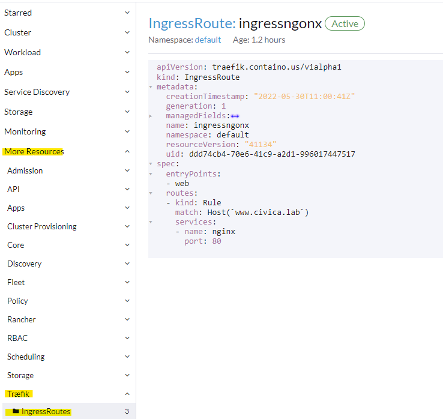

una vez llegues aqui ya estaria todo correcto para poder acceder a la web mediante el match que le has establecido.

## Instalación del servicio MkDocs

Para crear este servicio vamos a crear un Deployments en Racher:

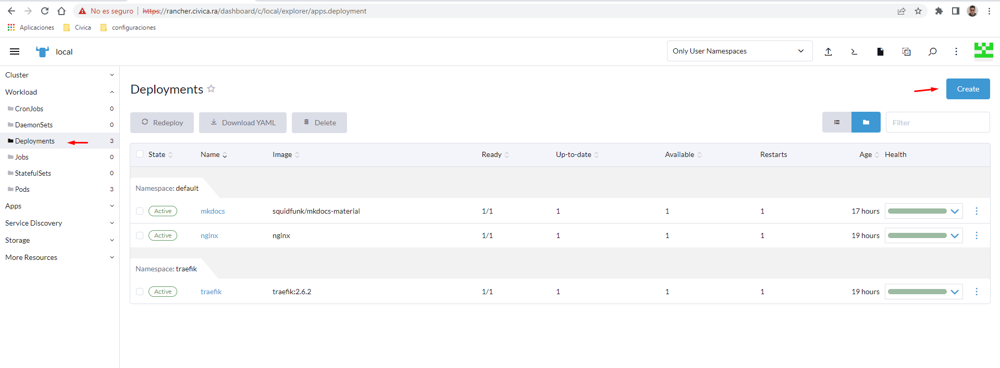

Le asignamos nombre, descripción, número de réplicas, el nombre de la imágen y añadimos un puerto en modo ClusterIP:

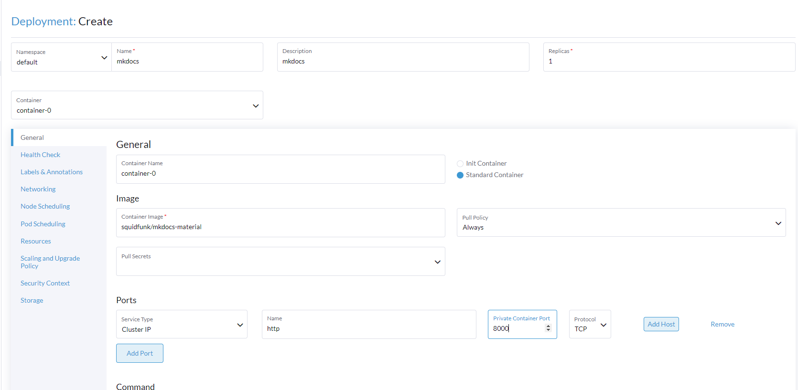

Por último le montamos un volumen de tipo **Bind-Mount** en el cual pondremos en la parte superior la ruta de la carpeta en el host y le marcamos que la carpeta existe (En está carpeta estará el contenido de Markdown con su mkdocs.yml) y en la parte inferior en donde se montará la carpeta en el contenedor:

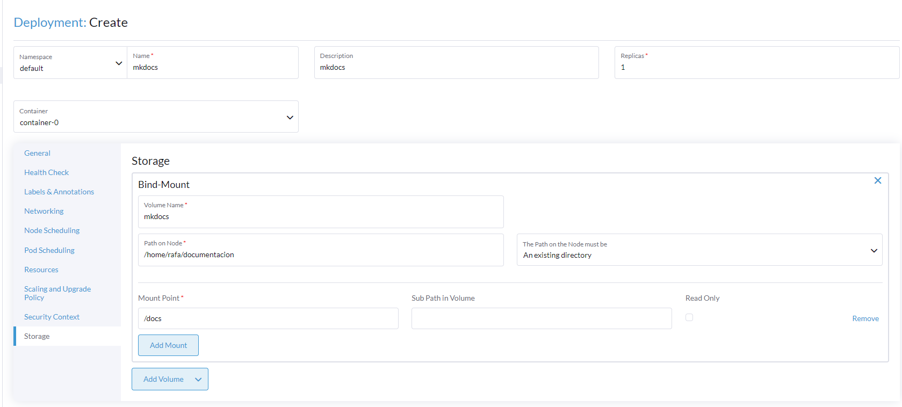

Al terminar le damos a crear y esperamos un rato a que se decarge la imagen y se termine de crear los pods:

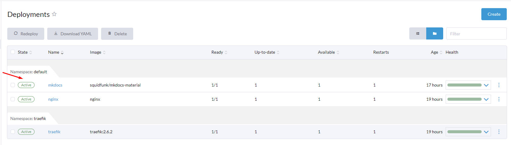

Luego podremos crear una regla de traefik para poder acceder con una URL a la aplicación:

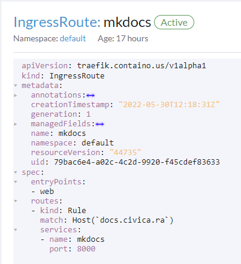

Poniendo la URL que hemos especificado en el Traefik ya podremos acceder al servicio:

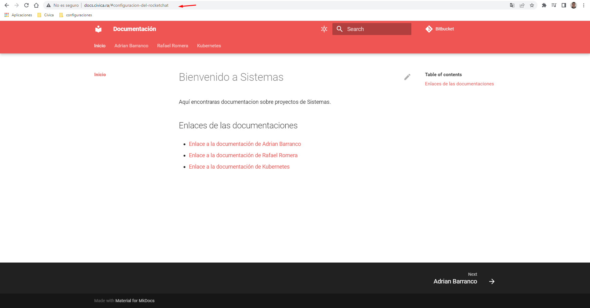

## Instalación del Middleware Error-Pages

Para instalar este servicio tenemos que crear un nuevo deployment en el cual instalaremos el servicio de Error de Páginas:

~~~
apiVersion: apps/v1
kind: Deployment
metadata:
  name: error-pages-middleware
  labels:
    app: error-pages-middleware
spec:
  revisionHistoryLimit: 2
  strategy:
    type: RollingUpdate
  replicas: 1
  selector:
    matchLabels:
      app: error-pages-middleware
  template:
    metadata:
      labels:
        app: error-pages-middleware
    spec:
      containers:
      - image: tarampampam/error-pages
        name: error-pages
        env:
          - name: TEMPLATE_NAME
            value: app-down
~~~

Luego crearemos el servicio para asignarle su puerto:

~~~
apiVersion: v1
kind: Service
metadata:
  name: error-pages-middleware
spec:
  selector:
    app: error-pages-middleware
  ports:
    - protocol: TCP
      port: 8080
      targetPort: 8080
~~~

Y por último creamos la regla de traefik para que reconozca el servicio como un Middleware:

~~~
apiVersion: traefik.containo.us/v1alpha1
kind: Middleware
metadata:
  name: error-pages-middleware
spec:
  errors:
    status:
      - "400-599"
    query: /{status}.html
    service:
      name: error-pages-middleware
      port: 8080
~~~

Con todos los archivos creados ya podremos desplegar el servicio ejecutando el siguiente comando a la carpeta donde tenemos estos tres archivos:

~~~
rafa@master:~$ sudo kubectl apply -f error-pages/
deployment.apps/error-pages-middleware created
middleware.traefik.containo.us/error-pages-middleware created
service/error-pages-middleware created
~~~

Ahora nos vamos al ingress del servicio MkDocs para mostrar un ejemplo de como funciona y le asignamos el Middleware que acabamos de crear:

~~~
apiVersion: traefik.containo.us/v1alpha1
kind: IngressRoute
metadata:
  name: mkdocs
spec:
  entryPoints:
  - web
  routes:
  - kind: Rule
    match: Host(`docs.civica.ra`)
    middlewares:
    - name: error-pages-middleware
    services:
    - name: mkdocs
      port: 8000
~~~

En el traefik ya podemos ver que se le está aplicando en el MkDocs el Middleware que hemos instalado:

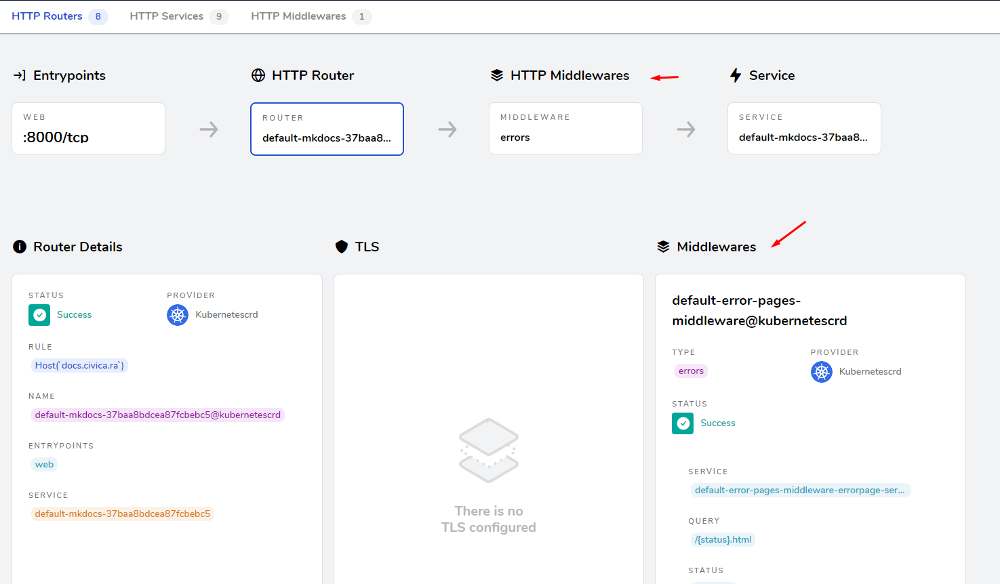

Ahora si nos vamos a la página de MkDocs y ponemos una ruta que no exite podemos ver que el Middleware funciona correctamente:

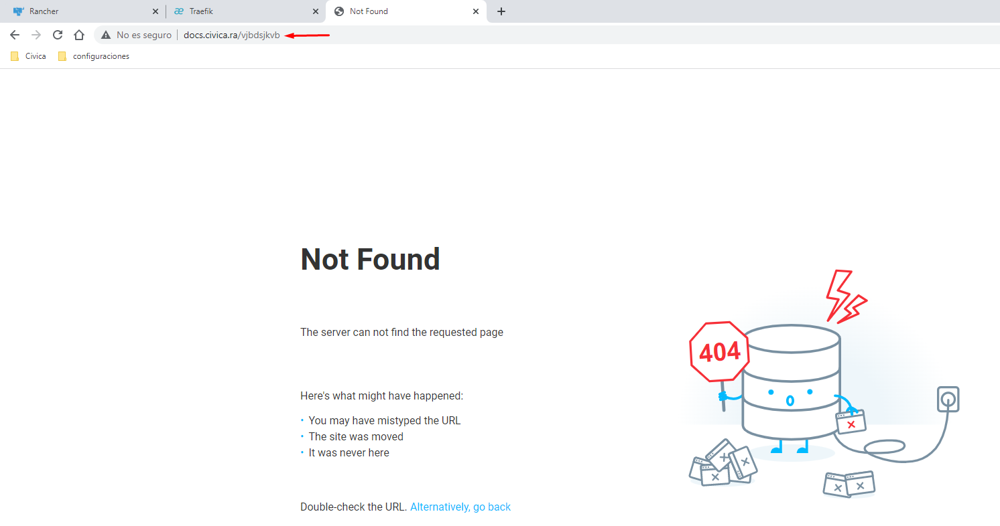