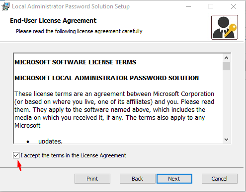
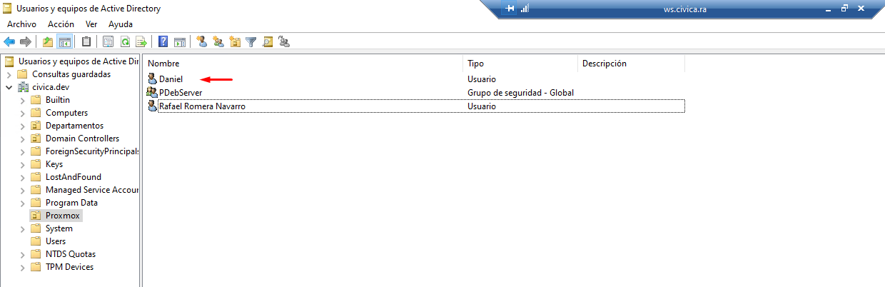

# Documentación de Rafael Romera Navarro

## Instalación y Configuración de LAPS

En esta guía vamos a ver como se instala y configura LAPS en el servidor Windows Server 2022, y la instalación automatizada en los clientes del dominio.

### Instalación en Windows Server 2022 

- El paquete de instalación de LAPS se encuentra en el siguiente [enlace](https://www.microsoft.com/en-us/download/details.aspx?id=46899), dentro de la página hacemos click en Download:

- Descargamos la versión de 64 bits (Aunque si tenemos equipos de 32 bits nos tendremos que descargar también la versión de 32 bits para la instalación de equipos clientes):

Ejecutamos el archivo de instalación:

- Aceptamos los términos y condiciones:

- Instalamos solo las características del servidor que son todas exepto la primera característica que es la del cliente:

- Y con esto terminamos la instalación:

### Configuración de LAPS en Windows Server 2022

- Una vez instalado tenemos que configurarlo para su funcionamiento, para ello tenemos que abrir una PowerShell y importar los módulos:

~~~~
Import-Module AdmPwd.PS
~~~~

- Importados los módulos tenemos que actualizar el esquema:
~~~~
Update-AdmPwdADSchema
~~~~

- Le asignamos el permiso para poder cambiar la contraseña a la unidad organizativa que en este caso será *Compras*:

~~~~
Set-AdmPwdComputerSelfPermission -OrgUnit Compras
~~~~

- Creamos un grupo para que tenga permisos para leer la contraseña de Administrador:

- En este caso el grupo se llamara *LAPS*:

- El grupo que hemos creado lo uniremos al grupo de administradores del dominio:

- Con los siguientes comandos le asignaremos el permiso de poder leer las contraseñas al grupo que hemos creado anteriormente a la unidad organizativa *Compras*:

~~~~
Set-AdmPwdReadPasswordPermission -OrgUnit "Compras" -AllowedPrincipals "LAPS"
Set-AdmPwdResetPasswordPermission -OrgUnit "Compras" -AllowedPrincipals "LAPS"
~~~~

- Por último vamos a crear una GPO a la unidad organizativa de Compras:

- La llamaremos *Configuración LAPS*:

- Editamos la GPO y no iremos a la siguiente ruta:

- En esta dirección tenemos las reglas que nos ofrece LAPS

    - **Password Setting:**  Es la directiva en la que se puede modificar cual va a ser la loSngitud y que tipo de caracteres va a tener la contraseña.

    - **Name of administrator account to manage:** Se utiliza cuando se ha cambiado el nombre de la cuenta del administrador, y se le refiere el nuevo nombre de dicha cuenta.

    - **Do not allow password expiration time longer than required by policy:** No permite que el tiempo de caducidad de la contraseña sea superior al requerido por la política.

    - **Enable Local Admin Password:** Habilita la cuenta de administrador.

- Habilitamos todas las opciones, la primera dejamos los ajustes por defecto, y en la segunda le vamos a poner *Compras_Admin*:

- Para que se cambie el nombre del Administrador nos vamos al siguiente directorio:

- Cambiamos el nombre de la cuenta del administador con el mismo nombre que pusimos en el LAPS y también activamos la directiva que activa la cuenta del Administador Local:

- Con esto el servidor ya estaría configurado.

### Instalación de LAPS de manera automática en el Cliente

- Lo primero que tenemos que hacer es crear una unidad compartida en mi caso se llamará *Programas* la cual tendrá todos los usuario con control total:

- Dentro de la unidad compartida meteremos el archivo de [instalación del LAPS](#instalación-en-windows-server-2022 ) que nos descargamos al principio:

- Creamos una GPO la cual la llamaremos *Instalar LAPS Clientes*:

- La editamos y nos vamos a la siguiete ruta:

- Añadimos un nuevo paquete:

- Buscamos el instalador por la ruta de la unidad compartida:

- Nos aparecerá el paquete:

- Actualizamos las directivas tanto en el servidor como en el cliete con el siguiete comando de PowerShell:

~~~~
gpupdate /force
~~~~

- Nos pedirá que reiniciemos el Cliente Windows, una vez reiniciado nos vamos a Configuración/Aplicaciones para poder ver que se ha instalado correctamente:

### Funcionamiento
- Una vez instalado y configurado en el servidor tenemos que abrir la aplicación **LAPS UI**:

- En la casilla de *Computer name:* tenemos que poner el nombre del equipo que tengamos en la unidad organizativa de *Compras*, en mi caso es *ORD-COMPRAS* y le damos a buscar:

- Como resultado nos dará la contraseña del usuario Administrador Local, cuando expira la contraseña y la opción de cambiar la fecha de expiración:

- Para comprobar que funciona nos vamos a ir al cliente y nos vamos a identificar con el nuevo nombre y contraseña del Administrador:

- Podremos ver que nos hemos identificado con el nuevo nombre y contraseña en la cuente de Administrador Local:

Con esto ya estaría intalado y configurado LAPS.

## Instalación y Configuración del Proxy Traefik

En esta guia se verá como instalar y configurar Traefik con Docker Compose y ficheros de configuración .toml tanto estáticos como dinámicos.

### Creación del fichero Docker Compose y traefik.toml

- Para empezar tenemos que crear un red en docker para que todos los contenedores estén en esta nueva red, para ello usamos el siguiete comando:

~~~~
docker network create traefik
~~~~

- Ahora crearemos una carpeta en donde almacenaremos los ficheros de docker y traefik (en mi caso la carpeta se llamará traefik):

~~~~
mkdir traefik
~~~~

- Dentro de la carpeta que acabamos de crear, crearemos en primer lugar el fichero [docker-compose.yml](./files/docker-compose-traefik.yml) y en el esribiremos lo siguiente:

- Creamos el archivo de configuración [traefik.toml](./files/traefik.toml) que es el archivo de configuración estático:

- Luego creamos la carpeta en donde almacenaremos los servicios:

~~~~
mkdir traefik/services
~~~~

- Un ejemplo de servicio [https](./files/proxmox.toml) es el siguiente:

- Un ejemplo de servicio [TCP](./files/EscritorioRemoto.toml):

### Configuración de MkDocs con traefik

-  Lo primero es crear otra carpeta separada de la carpeta de traefik en mi caso la llamaré documentos:

~~~~
mkdir documentos
~~~~

- Dentro de la carpeta crearemos un [docker compose](./files/docker-compose-mkdocs.yml) para el MkDocs, importante que la versión sea la misma que el archivo docker-compose del traefik.

- En esté archivo hay dos servicios, el primer servicio se encarga de darnos [páginas de error](https://github.com/tarampampam/error-pages) html personalizadas, y el segundo servicio es el MkDocs:

## Autentificación en RocketChat con Active Directory

Vamos a configurar el servicio RocketChat para que pueda utilizar la autentificación del Active Directory.

### Creación del usuario enlazador en el Active Directory

- Tenemos que crear un usuarios en el dominio en la carpeta Users (Aunque podría crease en cualquier otra unidad organizativa).

- Importante que el usuario tenga el mismo **Nombre Completo** que el **Nombre de Inicio de Sesión**:

### Configuración del RocketChat

- En la configuración del Rocket Chat nos vamos al apartado de **LDAP** el cual lo habilitaremos y lo configuraremos poniendo que el tipo de servidor es de Directorio Activo, la IP del servidor y su puerto por el que establecerá la conexión:

- Nos autenticamos con el usuario que creamos anteriormente, poniendo la ruta completa del esquema:

- Editamos el filtro de búsqueda de los usuarios poniendo la **Base DN** nuestro dominio, editamos el filtro escribiendo el siguiente **' (&(objectclass=user)(!(objectclass=computer))) '**, por último el campo de búsqueda le ponemos **sAMAccountName**:

- Le ponemos el dominio predeterminado:

- Con la configuración terminada lo guardamos y sincronizamos:

- Hacemos una conexión de prueba:

- Probamos a buscar un usuario:

- Vamos a inciar sesión con un usuario del dominio (en mi caso probare con el siguiente usauario):

