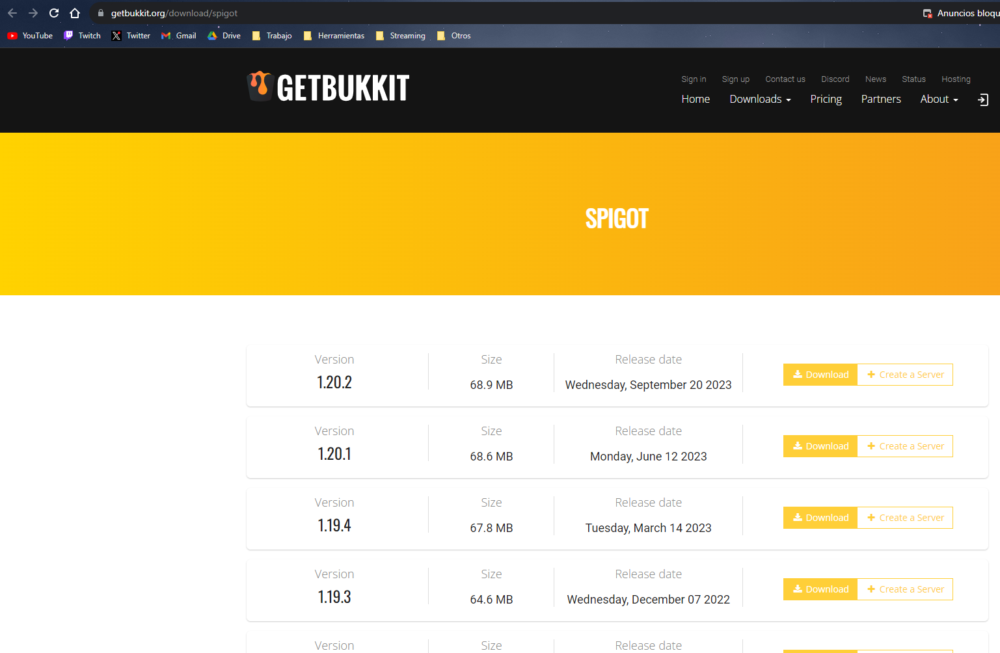
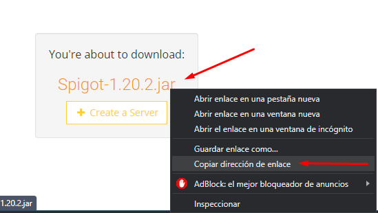

# Configuración del Servidor Minecraft en Debian

## Preparación del Servidor

Para crear un servidor del Minecraft lo primero es configurar una IP fija en el servidor desde el siguiente archivo **/etc/network/interfaces**:

````
# This file describes the network interfaces available on your system
# and how to activate them. For more information, see interfaces(5).

source /etc/network/interfaces.d/*

# The loopback network interface
auto lo
iface lo inet loopback

# The primary network interface
allow-hotplug ens18 # Que se conecte automática mente la tarjeta de red ens18
#iface ens18 inet dhcp (Comento la línea para quitar el DHCP)
# This is an autoconfigured IPv6 interface
iface ens18 inet6 auto
iface ens18 inet static # Pongo la  tarjeta de red en estática
address 192.168.1.251/24 # Pongo la IP fija + máscara de red
gateway 192.168.1.1 # Y la puerta de enlace
````

Luego nos vamos instalamos en el servidor el Java:

```

apt install default-jre default-jdk

```

Una vez instalado el java nos vamos la carpeta **/opt** y dentro creamos la carpeta donde alojaremos el servidor:

```

mkdir \*nombre del servidor\*

```

## Instalar servidor Spigot

Para crear un servidor con Plugins tenémos que hacer los siguiente pasos:
No vamos a la página de descarga de servidor de [Spigot](https://getbukkit.org/download/spigot):



Elegimos la versión que queramos, le damos click derecho y copiamos el enlace:



Descargamos el archivo en el servidor con el comando **wget** + **Enlace Copiado**:

```

wget https://download.getbukkit.org/spigot/spigot-1.20.2.jar

```

Renombramos el archivo que nos hemos dercargado y le ponemos el nombre de **servidor.jar**:

```

mv spigot-1.20.2.jar server.jar

```

Creamos un script para el arranque del servidor:

```

nano autorun.sh

```

Con el siguiente contenido:

```

#!/bin/bash
java -Xmx2048M -Xms2048M -jar server.jar nogui

# Asignamos la memoria RAM en MB

```

Le damos permisos de ejecución al script:

```

chmod +x autorun.sh

```

Ejecutamos el script:

```

./autorun.sh

```

Una vez ejecutado el programa deben a ver aparecido más ficheros:

```

root@minecraft:/opt/docs# ls
autorun.sh bundler eula.txt logs server.jar server.properties

```

Editamos el fichero **aula.txt** y cambiamos el **false** a **true**:

```

#By changing the setting below to TRUE you are indicating your agreement to our EULA (https://aka.ms/MinecraftEULA).
#Fri Dec 01 11:10:24 CET 2023
eula=true #Cambiar a true para que permita ejecutar el servidor

```

Volvemos a ejecutar **autorun.sh** y nos deben aparecer más ficheros:

```

ls
autorun.sh bukkit.yml crash-reports logs server.jar whitelist.json
banned-ips.json bundler eula.txt ops.json server.properties world
banned-players.json commands.yml help.yml plugins spigot.yml

```

Modíficamos el archivo [**server.properties**](./files/server.properties):

```

#Minecraft server properties
#Fri Dec 01 11:15:53 CET 2023
enable-jmx-monitoring=false
rcon.port=25575
level-seed=
gamemode=survival
enable-command-block=false
enable-query=false
generator-settings={}
enforce-secure-profile=true
level-name=world # Nombre de la carpeta donde se aloja el mundo del servidor
motd=A Minecraft Server
query.port=25565
pvp=true
generate-structures=true
max-chained-neighbor-updates=1000000
difficulty=hard # Difucultad del servidor
network-compression-threshold=256
max-tick-time=60000
require-resource-pack=false
use-native-transport=true
max-players=20 # Número máximo de jugadores simultáneos
online-mode=true # Si está en true solo pueden jugar jugadores Premiun
enable-status=true
allow-flight=false
initial-disabled-packs=
broadcast-rcon-to-ops=true
view-distance=10
server-ip=192.168.1.251 # El dirección IP del servidor
resource-pack-prompt=
allow-nether=true
server-port=25565 # El puerto del servidor
enable-rcon=false
sync-chunk-writes=true
op-permission-level=4
prevent-proxy-connections=false
hide-online-players=false
resource-pack=
entity-broadcast-range-percentage=100
simulation-distance=10
rcon.password=
player-idle-timeout=0
debug=false
force-gamemode=false
rate-limit=0
hardcore=false # Si mueres es pa siempre
white-list=false
broadcast-console-to-ops=true
spawn-npcs=true
spawn-animals=true
log-ips=true
function-permission-level=2
initial-enabled-packs=vanilla
level-type=minecraft\:normal
text-filtering-config=
spawn-monsters=true
enforce-whitelist=false # Activar la WhiteList
spawn-protection=0 # Protección del Spawn para que no puedan romper bloques
resource-pack-sha1=
max-world-size=29999984

```

Si queremos meter Plugins los tenemos que subir a la carpeta de **plugins**.

Para iniciar el servidor es con el script:

```

./autorun.sh

```

Y con eso ya estaría el servidor funcionando.

## Configuración del terminal en segundo plano

Para poder dejar el servidor del minecraft abierto en segundo plano se hace con el programa **tmux**,

Instalamos el programa con el siguinte comando:

```

apt install tmux

```

Comandos de tmux:

- Crear una nueva terminal:

```

tmux new -s [nombre_del_terminal]

```

- Entrar a una terminal:

```

tmux attach -t [nombre_del_terminal]

```

- Salir de una terminal: **Ctrl** + **B** y luego la tecla **D**

Dentro de una terminal de tmux puedes ejecutar el servidor y derjarlo en segundo plano sin que se cierre.
```
