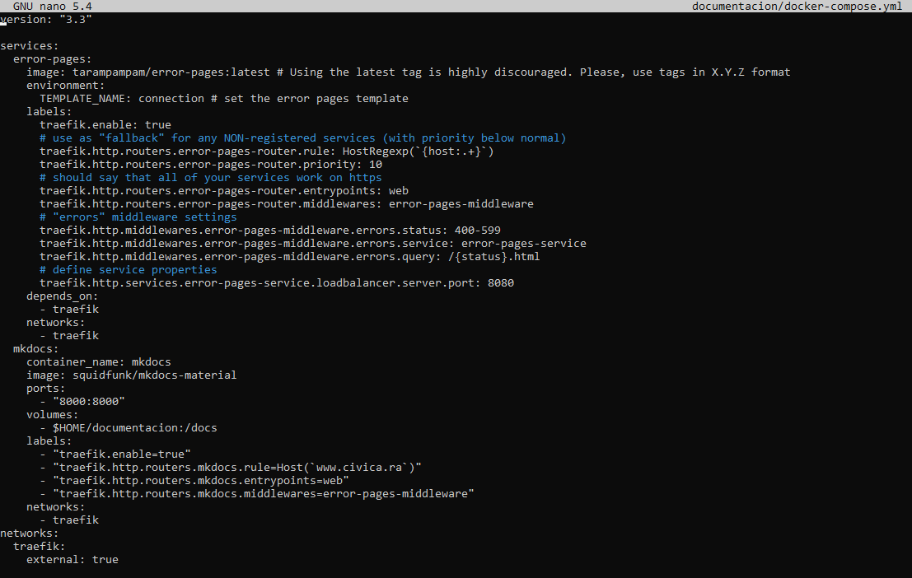

## Configuración de MkDocs con traefik

- Lo primero es crear otra carpeta separada de la carpeta de traefik en mi caso la llamaré documentos:

```
mkdir mkdocs
```

- Dentro de la carpeta crearemos un [docker compose](./files/docker-compose-mkdocs.yml) para el MkDocs, importante que la versión sea la misma que el archivo docker-compose del traefik:

```
version: "3.3"

services:
  error-pages:
    image: tarampampam/error-pages:latest # Using the latest tag is highly discouraged. Please, use tags in X.Y.Z format
    environment:
      TEMPLATE_NAME: connection # set the error pages template
    labels:
      traefik.enable: true
      # use as "fallback" for any NON-registered services (with priority below normal)
      traefik.http.routers.error-pages-router.rule: HostRegexp(`{host:.+}`)
      traefik.http.routers.error-pages-router.priority: 10
      # should say that all of your services work on https
      traefik.http.routers.error-pages-router.entrypoints: web
      traefik.http.routers.error-pages-router.middlewares: error-pages-middleware
      # "errors" middleware settings
      traefik.http.middlewares.error-pages-middleware.errors.status: 400-599
      traefik.http.middlewares.error-pages-middleware.errors.service: error-pages-service
      traefik.http.middlewares.error-pages-middleware.errors.query: /{status}.html
      # define service properties
      traefik.http.services.error-pages-service.loadbalancer.server.port: 8080
    depends_on:
      - traefik
    networks:
      - traefik
  mkdocs:
    container_name: mkdocs
    image: squidfunk/mkdocs-material
    ports:
      - "8000:8000"
    volumes:
      - ~{PWD}/documentacion:/docs
    labels:
      - "traefik.enable=true"
      - "traefik.http.routers.mkdocs.rule=Host(`docs.borderlands.sytes.net`)"
      - "traefik.http.routers.mkdocs.entrypoints=web"
      - "traefik.http.routers.mkdocs.middlewares=error-pages-middleware"
    networks:
      - traefik
networks:
  traefik:
    external: true

```

- En esté archivo hay dos servicios, el primer servicio se encarga de darnos [páginas de error](https://github.com/tarampampam/error-pages) html personalizadas, y el segundo servicio es el MkDocs:


