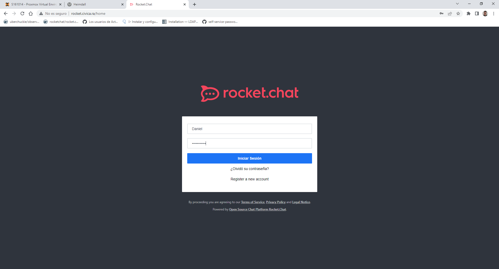

# Configuración de Servicios

## Configuración del Servicio RocketChat

### Autentificación en RocketChat con Active Directory

Vamos a configurar el servicio RocketChat para que pueda utilizar la autentificación del Active Directory.

#### Creación del usuario enlazador en el Active Directory

- Tenemos que crear un usuarios en el dominio en la carpeta Users (Aunque podría crease en cualquier otra unidad organizativa).

- Importante que el usuario tenga el mismo **Nombre Completo** que el **Nombre de Inicio de Sesión**:

#### Configuración del RocketChat

- En la configuración del Rocket Chat nos vamos al apartado de **LDAP** el cual lo habilitaremos y lo configuraremos poniendo que el tipo de servidor es de Directorio Activo, la IP del servidor y su puerto por el que establecerá la conexión:

- Nos autenticamos con el usuario que creamos anteriormente, poniendo la ruta completa del esquema:

- Editamos el filtro de búsqueda de los usuarios poniendo la **Base DN** nuestro dominio, editamos el filtro escribiendo el siguiente **' (&(objectclass=user)(!(objectclass=computer))) '**, por último el campo de búsqueda le ponemos **sAMAccountName**:

- Le ponemos el dominio predeterminado:

- Con la configuración terminada lo guardamos y sincronizamos:

- Hacemos una conexión de prueba:

- Probamos a buscar un usuario:

- Vamos a inciar sesión con un usuario del dominio (en mi caso probare con el siguiente usauario):

