# Documentación de Windows

## Instalación y Configuración de LAPS

En esta guía vamos a ver como se instala y configura LAPS en el servidor Windows Server 2022, y la instalación automatizada en los clientes del dominio.

### Instalación en Windows Server 2022 

- El paquete de instalación de LAPS se encuentra en el siguiente [enlace](https://www.microsoft.com/en-us/download/details.aspx?id=46899), dentro de la página hacemos click en Download:

- Descargamos la versión de 64 bits (Aunque si tenemos equipos de 32 bits nos tendremos que descargar también la versión de 32 bits para la instalación de equipos clientes):

Ejecutamos el archivo de instalación:

- Aceptamos los términos y condiciones:

- Instalamos solo las características del servidor que son todas exepto la primera característica que es la del cliente:

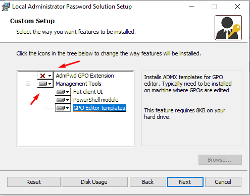

- Y con esto terminamos la instalación:

### Configuración de LAPS en Windows Server 2022

- Una vez instalado tenemos que configurarlo para su funcionamiento, para ello tenemos que abrir una PowerShell y importar los módulos:

~~~~
Import-Module AdmPwd.PS
~~~~

- Importados los módulos tenemos que actualizar el esquema:
~~~~
Update-AdmPwdADSchema
~~~~

- Le asignamos el permiso para poder cambiar la contraseña a la unidad organizativa que en este caso será *Compras*:

~~~~
Set-AdmPwdComputerSelfPermission -OrgUnit Compras
~~~~

- Creamos un grupo para que tenga permisos para leer la contraseña de Administrador:

- En este caso el grupo se llamara *LAPS*:

- El grupo que hemos creado lo uniremos al grupo de administradores del dominio:

- Con los siguientes comandos le asignaremos el permiso de poder leer las contraseñas al grupo que hemos creado anteriormente a la unidad organizativa *Compras*:

~~~~
Set-AdmPwdReadPasswordPermission -OrgUnit "Compras" -AllowedPrincipals "LAPS"
Set-AdmPwdResetPasswordPermission -OrgUnit "Compras" -AllowedPrincipals "LAPS"
~~~~

- Por último vamos a crear una GPO a la unidad organizativa de Compras:

- La llamaremos *Configuración LAPS*:

- Editamos la GPO y no iremos a la siguiente ruta:

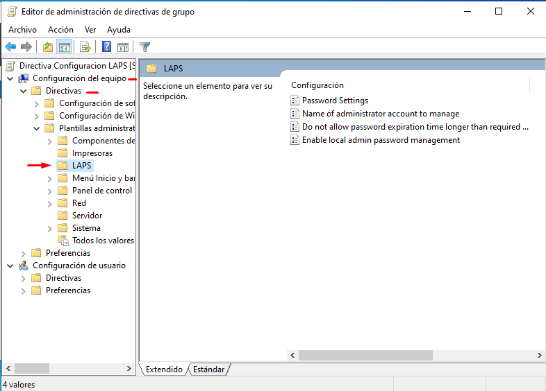

- En esta dirección tenemos las reglas que nos ofrece LAPS

    - **Password Setting:**  Es la directiva en la que se puede modificar cual va a ser la loSngitud y que tipo de caracteres va a tener la contraseña.

    - **Name of administrator account to manage:** Se utiliza cuando se ha cambiado el nombre de la cuenta del administrador, y se le refiere el nuevo nombre de dicha cuenta.

    - **Do not allow password expiration time longer than required by policy:** No permite que el tiempo de caducidad de la contraseña sea superior al requerido por la política.

    - **Enable Local Admin Password:** Habilita la cuenta de administrador.

- Habilitamos todas las opciones, la primera dejamos los ajustes por defecto, y en la segunda le vamos a poner *Compras_Admin*:

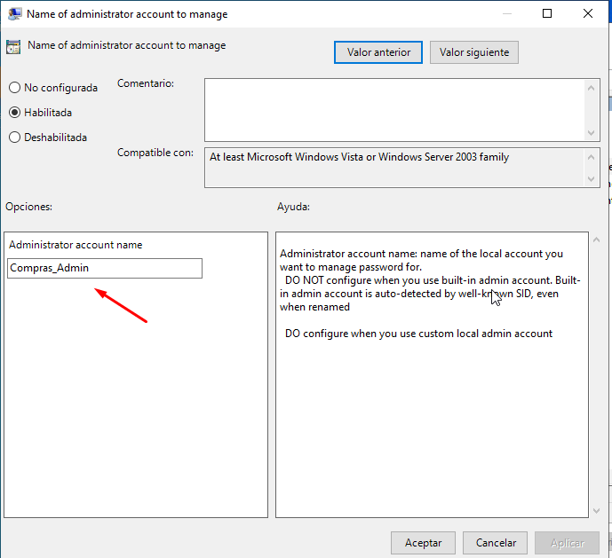

- Para que se cambie el nombre del Administrador nos vamos al siguiente directorio:

- Cambiamos el nombre de la cuenta del administador con el mismo nombre que pusimos en el LAPS y también activamos la directiva que activa la cuenta del Administador Local:

- Con esto el servidor ya estaría configurado.

### __Nota*__

---

Al instalar LAPS enlace la GPO al dominio y se me cambio la contraseña del administrador, por lo que no podía entrar con dicho usuario. Por suerte tenia iniciada sesion con el en un cliente.
Para poder cambiarle la contraseña instale RSAT en el cliente donde tenia el usuario administrador iniciada sesión, mediante consola abri una sesion como administrador local e instale RSAT ya que con el administrador del dominio no se terminaba de instalar bien. Una vez realizado eso correstamente abres una consola de Powershell e importa el modulo ActiveDirectory y le cambias la contraseña al administrador.

---

### Instalación de LAPS de manera automática en el Cliente

- Lo primero que tenemos que hacer es crear una unidad compartida en mi caso se llamará *Programas* la cual tendrá todos los usuario con control total:

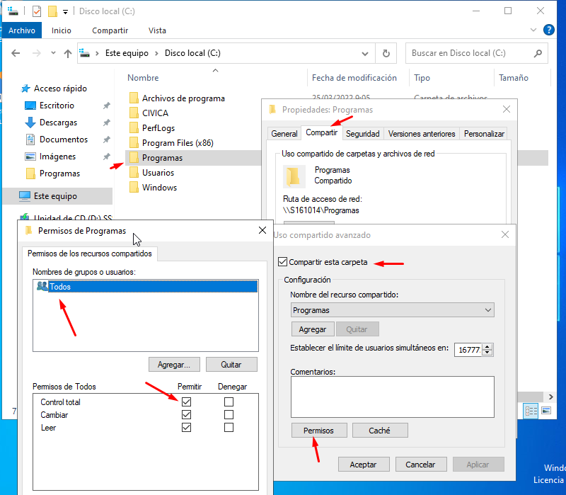

- Dentro de la unidad compartida meteremos el archivo de [instalación del LAPS](#instalación-en-windows-server-2022 ) que nos descargamos al principio:

- Creamos una GPO la cual la llamaremos *Instalar LAPS Clientes*:

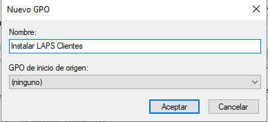

- La editamos y nos vamos a la siguiete ruta:

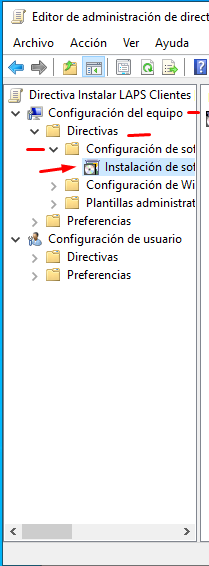

- Añadimos un nuevo paquete:

- Buscamos el instalador por la ruta de la unidad compartida:

- Nos aparecerá el paquete:

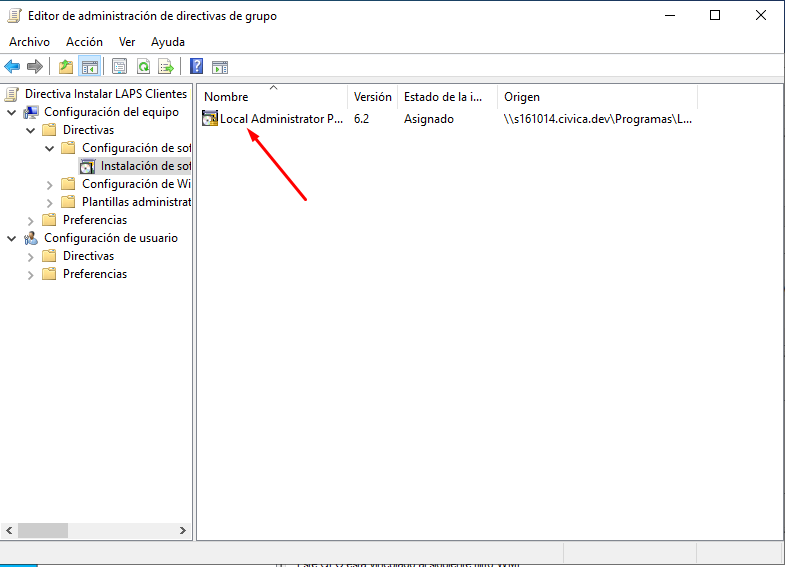

- Actualizamos las directivas tanto en el servidor como en el cliete con el siguiete comando de PowerShell:

~~~~
gpupdate /force
~~~~

- Nos pedirá que reiniciemos el Cliente Windows, una vez reiniciado nos vamos a Configuración/Aplicaciones para poder ver que se ha instalado correctamente:

### Funcionamiento
- Una vez instalado y configurado en el servidor tenemos que abrir la aplicación **LAPS UI**:

- En la casilla de *Computer name:* tenemos que poner el nombre del equipo que tengamos en la unidad organizativa de *Compras*, en mi caso es *ORD-COMPRAS* y le damos a buscar:

- Como resultado nos dará la contraseña del usuario Administrador Local, cuando expira la contraseña y la opción de cambiar la fecha de expiración:

- Para comprobar que funciona nos vamos a ir al cliente y nos vamos a identificar con el nuevo nombre y contraseña del Administrador:

- Podremos ver que nos hemos identificado con el nuevo nombre y contraseña en la cuente de Administrador Local:

Con esto ya estaría intalado y configurado LAPS.

# GPOs

### Borrar administrador local

No se puede borrar el administrador local de un equipo, lo unico que se permite es cambiarle el nombre y desactivar o activar la cuenta. Aparte de cambiarle la contraseña.

### Cambiar nombre de la cuenta administrador local

Para cambiar el nombre de la cuenta de administrador hay que realizar una GPO nueva que sería la siguiente:

### Personalizar escritorio de los usuarios

Para poder cambiar el fondo de los usuarios, creamos una GPO especifica para ello, la directiva es de usuarios y es la siguiente:

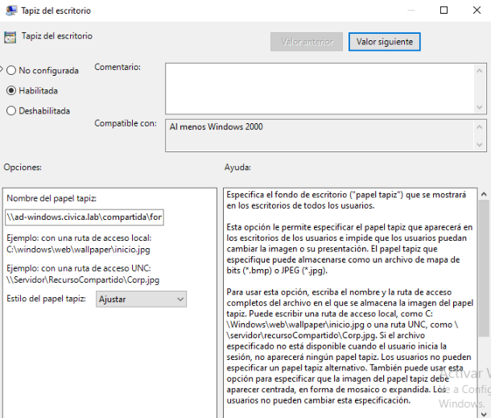

La ruta a al imagen tiene que estar en un directorio compartido.

### Conectar unidades de red

Para poder conectar una unidad de red a los usuarios es necesario crear otra GPO y enlazarla a la Unidad Organizativa correspondiente, esta seria la directiva:

### Instalación de software

Para instalar software hay una directiva la cual se encarga de eso, pero solo funciona con paquetes con extension msi. Pero la mayoria de la aplicaciones son nos msi son exe, entonces por este medio no se va ha poder instalar nuevo software tipo exe. Una posible solucion es convertir de extensio exe a msi pero no todos los paquetes lo soportan y ademas luego no se instala de manera correcta.

Por todo lo citado antes me he decantado por utilizar Chocolatey, ya que él se encarga de instalar los programas desde su propios repositorios. Lo unico que es que tiene que estar instalado en el cliente, para instalarlo he creado un script de PowerShell que instala en el cliente chocolatey.

#### Script instalacion Chocolatey desde PowerShell

### Script instalar programas

Para que lo haga de manera automatica he creado una GPO, para que cuando inicie el equipo cliente se instale todo automatico. El orden es importante primero se tiene que poner el script de powershell para la instalacion de de chocolatey y luego el script de instalacion de aplicaciones.

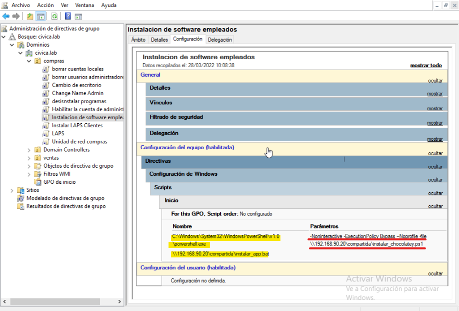

### Desinstalar aplicaciones

Para desinstalar aplicaciones mediante GPO, solo se puede desinstalar una aplicación que previamente se este instalada mediante GPO de lo contrario no se puede eleminar.

Para poder eliminar una aplicacion he creado una script de CMD, que consiste en buscar el programa que queremos borrar, una vez lo encuetra guarda la ruta en un archivo temporal y luego recorro el archivo para quedarme con la ruta donde esta el desinstalador y una vez la encuentre lanzo el desinstalador.

#### Script desinstalador

### Activar autentificación contra Directorio Activo de Proxmox

Un requisito previo es crear un grupo el cual van a estar dentro los usuarios administrador de AD para proxmox. En mi caso he creado un grupo que se llama VMadmin.

Una vez realizado lo anterior nos vamos a la interfaz web de Proxmox y una vez alli nos vamos a Datacenter y buscamos el apartado Realms y con figuramos uno nuevo de Active directory.

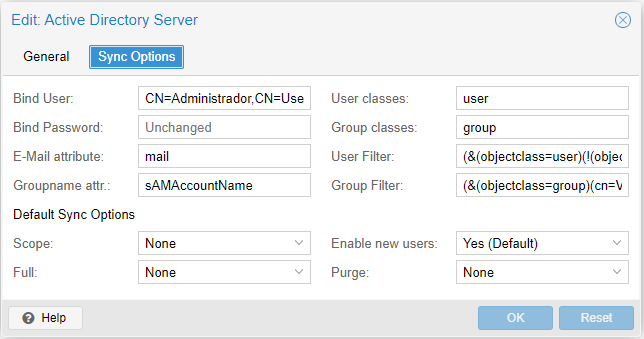

Una vez realizada esta configuracion toca sincronizar con el AD, para ello seleccionamos el nuevo realms y le damos a la aparte de arriba para sincronizar, si todo ha ido bien nos saldara en el estado OK.

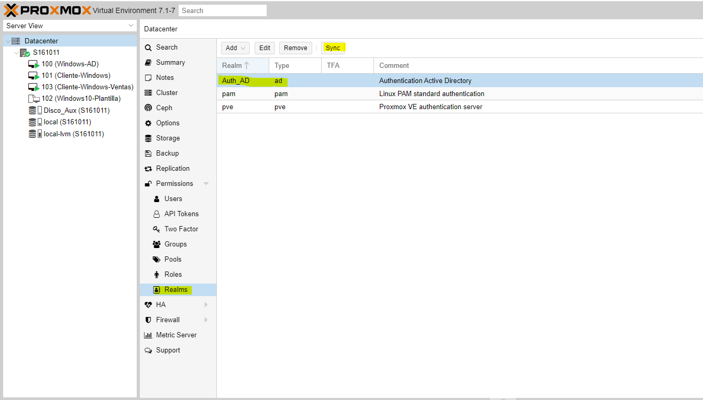

Una vez sincronizado toca dar permiso en proxmox al grupo de VMadmin para que los miembros de ese grupo puedan ser administradores. Para ello nos vamos a la parte de permisos y añadimo uno nuevo de grupo y le damos permisos en la raiz al grupo VMadmin-Auth_AD con el rol de Administradores.

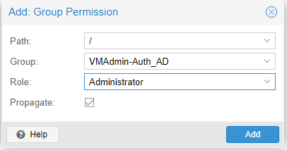

Una vez realizado esto ya estaria la autentificacion contra Directorio Activo en proxmox.

## Fallos de instalación de WSUS

El fallo que daba era sobre la base de datos que se almacena en WID, el fallo en cuestión mostraba un mensaje así:

    La versi¢n de esquema de la base de datos es de una versi¢n m s reciente de WSUS que la instalada actualmente. Debe aplicar la revisi¢n al servidor WSUS como m¡nimo a esa versi¢n o desconectar la base de datos.

y la solucion que encontre fue la siguiente:

- Como usuario administrador inicar una Powershell y realizar el comando siguiente, que se encarga de desistalar el WSUS:

        Uninstall-WindowsFeature -Name UpdateServices,Windows-Internal-Database -Restart

- Una ver realiazado tenermos que borrar la carpeta WID, que se encuentra en la siguiente ruta:

          C:\Windows\WID

- Por último lanzar este comando, que se encarga de volver a instalar el WSUS:

        Install-WindowsFeature UpdateServices -Restart

